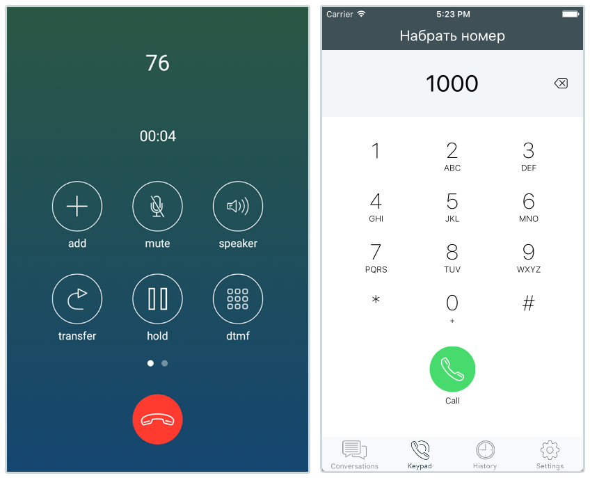

# Open-source SIP client for Android & IOS

Based on React Native and [ReactNativePJSIP](https://github.com/Excellent1212/React-Native-pjsip-App)



## Setup

1. **Clone the repo**

  ```
  $ git clone https://github.com/Excellent1212/React-Native-pjsip-App
  $ cd React-Native-pjsip-App
  ```

2. **Install dependencies**:

  ```
  $ npm install
  ```

3. **Running on Android**:

  ```
  $ react-native run-android
  ```

4. **Running on iOS:**

  ```
  $ react-native run-ios
  ```

